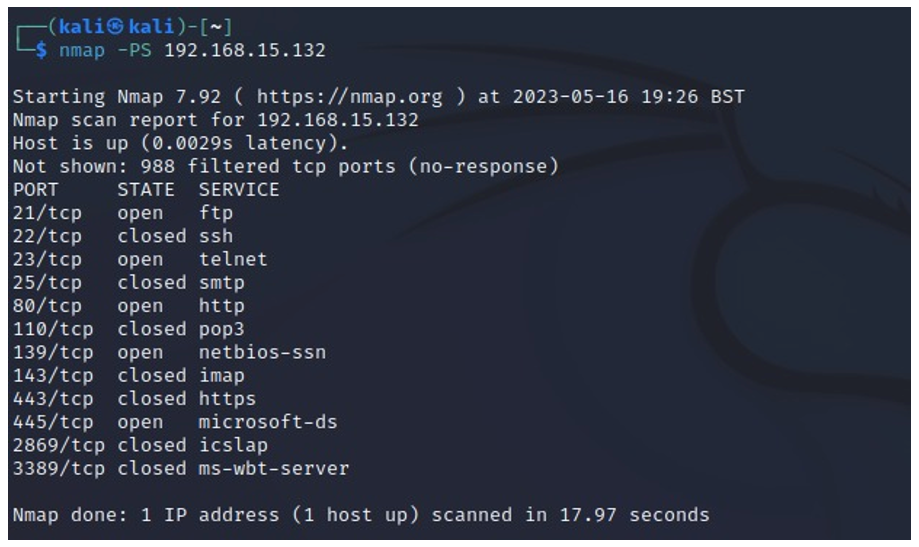
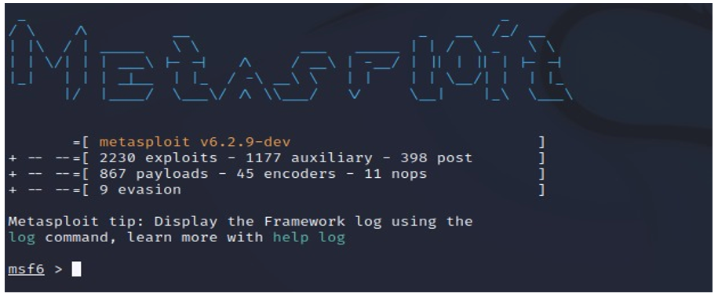
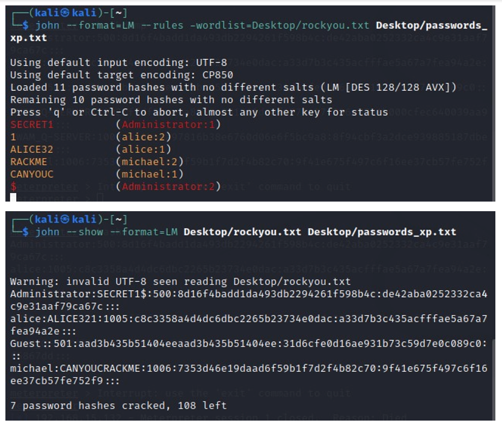
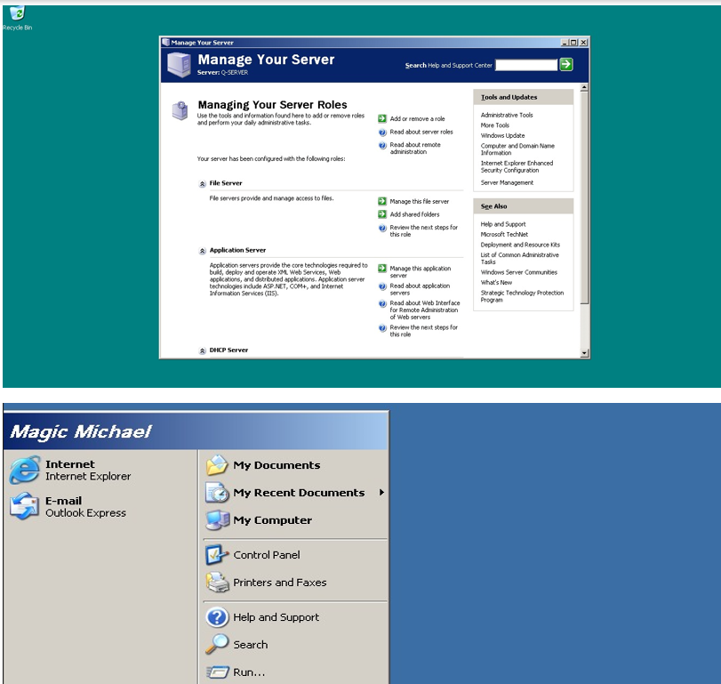

<h1><a href="https://github.com/prsilvaa"> Ethical Hacking & Penetration Testing</a></h1>

<h2>Project Objective</h2>

As a penetration tester, my goal was to identify vulnerabilities in a network that could allow attackers to steal or access sensitive company data. I carried out scanning, exploitation, password cracking, and vulnerability analysis using professional tools to assess the network’s security and demonstrate potential risks.

<h2>Tools Used</h2>
<ul>
    <li>Nmap</li>
    <li>Metasploit Framework</li>
    <li>John the Ripper</li>
    <li>Armitage</li>
</ul>

<h2>Skills Gained</h2>
<ul>
    <li>Network Scanning</li>
    <li>Exploitation Techniques</li>
    <li>Password Cracking</li>
    <li>Vulnerability Assessment</li>
</ul>

<h2>Outcome</h2>

I successfully completed a comprehensive penetration test on a server at college. During the assessment, I identified several critical vulnerabilities including a poorly configured firewall, multiple open ports, unprotected sensitive files, and weak, easily guessable passwords. These weaknesses could potentially allow unauthorized access and data theft. Based on these findings, I provided detailed recommendations to improve network security by properly configuring the firewall, closing unnecessary ports, securing confidential files, and enforcing strong password policies to help prevent future data breaches.

    <h3>Open Ports Scan</h3>
    
    
Scan results showing open ports on the target machine, indicating potential entry points.

    <h3>Metasploit Successful Exploit</h3>
    
    
Metasploit session established after successfully exploiting the target machine.

    <h3>John the Ripper Password Crack</h3>
    
    
John the Ripper output showing discovered passwords during the cracking process.

    <h3>Device Access with Password</h3>
    
    
Access granted to the device after successful password authentication, demonstrating control over the target system.

